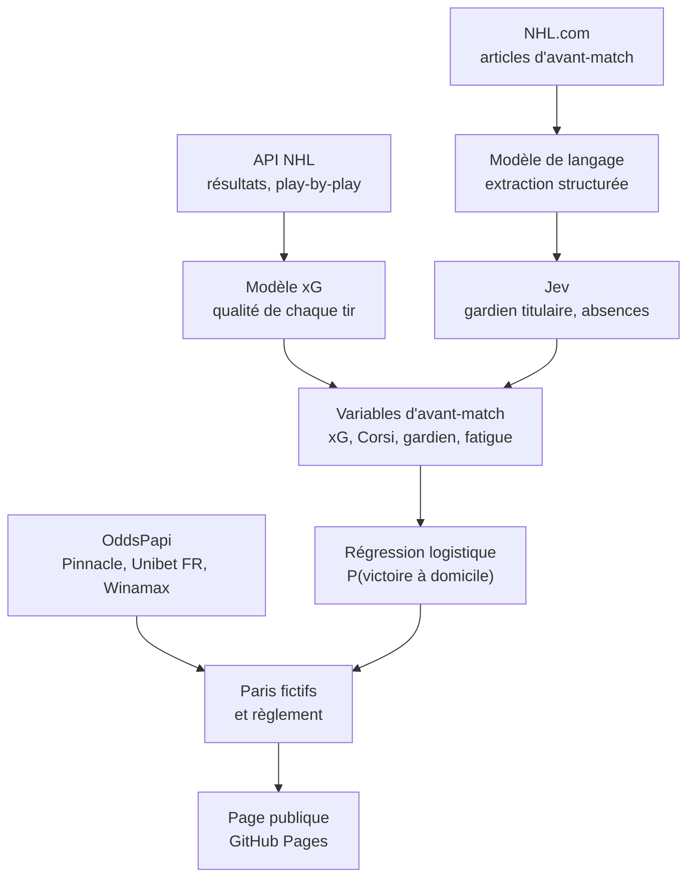

<p align="center">
  <a href="https://cr0zer.github.io/NHL-Predictor/">
    <picture>
      <source media="(prefers-color-scheme: dark)" srcset="assets/logo/png/horizontal/logo-horizontal-color-dark-1024w.png">
      
    </picture>
  </a>
</p>

<p align="center">
  Prédiction des matchs de NHL et <b>simulation de paris fictifs à mise fixe</b>, mise à jour automatiquement chaque jour.
</p>

<p align="center">
  <a href="https://github.com/CR0ZER/NHL-Predictor/actions/workflows/pipeline.yml"></a>
  <a href="https://cr0zer.github.io/NHL-Predictor/"></a>
  
  
</p>

<p align="center">
  <a href="https://cr0zer.github.io/NHL-Predictor/"><b>Voir la page</b></a> ·
  <a href="#fonctionnement">Fonctionnement</a> ·
  <a href="#résultats">Résultats</a> ·
  <a href="#automatisation">Automatisation</a> ·
  <a href="#utilisation-en-local">Utilisation en local</a>
</p>

---

Le projet cherche à savoir si un modèle statistique, nourri par l'actualité d'avant-match, peut faire mieux que le marché
des cotes. Chaque soir, il prédit les matchs, enregistre des paris fictifs aux cotes du moment, puis les règle le
lendemain avec les résultats officiels. **Aucun pari réel n'est jamais engagé.**

## Fonctionnement



- **Variable cible :** victoire de l'équipe à domicile, prolongation et tirs au but inclus. Le 1N2 en temps
  réglementaire (Winamax) en est déduit avec une probabilité de prolongation constante.
- **Règles anti-fuite :** chaque saison est prédite par un modèle appris sur les saisons précédentes ; un article n'est
  retenu que s'il a été publié *et* modifié avant le coup d'envoi ; la cote de clôture est la dernière publiée avant
  le coup d'envoi réel ; une prédiction n'est jamais refaite sur un match commencé.

| Fichier | Rôle |
|---|---|
| `xg.py` | Modèle xG (gradient boosting) appris saison par saison sur les tirs des saisons précédentes |
| `nhl.py` | Variables d'avant-match, modèle, backtest walk-forward, prédictions du jour |
| `news.py` | Actualité d'avant-match : articles NHL.com, extraction par un modèle de langage, jugement Jev |
| `odds.py` | Cotes OddsPapi (actuelles et de clôture), évaluation face au marché |
| `app.py` | Paris fictifs, règlement, mesures de qualité, export de la page ; serveur local avec boutons |
| `ui.html` | Interface : onglets Soirée, Simulation et Modèle |
| `test_nhl.py` | Garde-fous : aucune fuite d'information future, calcul de la CLV |
| `assets/logo/` | Kit logo (SVG, PNG, PDF, icônes web, images de partage) et sa charte |

## Résultats

Backtest walk-forward, chaque saison prédite par un modèle qui ne connaît que les saisons précédentes :

| Mesure | Valeur |
|---|---|
| Matchs hors échantillon (2018-19 → 2026-27) | 9 830 |
| Log loss (0,693 = pile ou face) | 0,6647 |
| Favori du modèle gagnant | 59,2 % |
| Face à Pinnacle à la clôture, 2025-26 (511 matchs) | 0,6726 contre 0,6719 |
| Face à Pinnacle à la clôture, début 2026-27 (43 matchs) | 0,6502 contre 0,6559 |

Le modèle est au niveau du marché le plus efficace, sans le battre de façon démontrée. La simulation sert à le
vérifier dans la durée : l'onglet **Modèle › Prédictions réelles** suit, soirée par soirée, la log loss du modèle face
à Pinnacle sur les mêmes matchs et la **CLV** des paris (cote prise ÷ cote de clôture − 1), un indicateur bien plus
fiable que le profit sur un petit nombre de paris.

## Stratégies simulées

Mise fixe de 10 € par pari, à la cote disponible au moment de la prédiction.

| Stratégie | Règle |
|---|---|
| Favori du modèle (Unibet FR, vainqueur) | Un pari par match sur l'équipe que le modèle donne gagnante |
| Valeur Unibet (vainqueur) | Côté où probabilité du modèle × cote − 1 est le plus élevé, s'il est positif |
| Valeur Winamax (1N2) | Même règle sur les trois issues |

## Automatisation

GitHub Actions ([`pipeline.yml`](.github/workflows/pipeline.yml)) fait tourner la chaîne sans intervention. Les
lancements sont déclenchés à l'heure exacte par [cron-job.org](https://cron-job.org) via l'API `workflow_dispatch` :
les déclenchements planifiés de GitHub partent souvent avec plusieurs heures de retard.

| Heure de Paris | Déclencheur | Tâche |
|---|---|---|
| 18 h 17 | cron-job.org | Règlement des paris terminés, puis prédiction de la soirée et paris fictifs aux cotes du moment |
| 8 h 13 | cron-job.org | Résultats officiels, règlement des paris et cotes de clôture de la veille |
| 23 h 47 (21 h 47 UTC) | cron GitHub, filet de sécurité | Rattrapage : seuls les matchs restés sans prédiction |
| 8 h 13 (6 h 13 UTC) | cron GitHub, filet de sécurité | Règlement de secours, sans effet s'il a déjà été fait |

Après chaque tâche, les prédictions et le registre de paris sont enregistrés dans le dépôt (`data/`) et la page est
republiée.

Secrets du dépôt : `OPENROUTER_API_KEY`, `TYPESAFE_API_KEY`, `ODDSPAPI_API_KEY`.

## Modèles de langage

L'extraction de l'actualité se choisit avec la variable d'environnement `NHL_LLM` : un nom de modèle Ollama (local),
ou une liste de modèles OpenRouter essayés dans l'ordre (le suivant prend le relais si l'un est saturé). Chaque carte
de match indique le modèle qui a lu l'actualité, ou « Actualité inaccessible » si la chaîne a échoué.

| Modèle | Où | Résultat sur les 43 premiers matchs de 2026-27 |
|---|---|---|
| **Nemotron 3 Super 120B** (`nvidia/nemotron-3-super-120b-a12b:free`) | OpenRouter, gratuit | **Production.** 6,7 s par match, gardien trouvé 91 %, absents « certains » exacts à 95 % |
| Gemma 4 26B / 31B (`:free`) | OpenRouter, gratuit | Secours (souvent saturés) |
| qwen3:8b | Ollama, local | Défaut en local. 22 s par match, gardien 87 %, absents exacts à 94 % |
| Llama 3.1 8B | Ollama, local | Abandonné (rappel plus faible, réponses JSON qui bouclent) |

Quota gratuit OpenRouter : 50 requêtes par jour, une par match.

## Utilisation en local

```bash
uv sync
uv run --env-file .env python app.py                 # interface avec boutons : http://127.0.0.1:8765
uv run --env-file .env python app.py predict          # ou rescue, settle, odds, export
uv run python nhl.py backtest                         # backtest walk-forward
uv run --env-file .env python news.py eval            # évaluation de la chaîne d'actualité
uv run --env-file .env python odds.py eval [SAISON]   # modèle face au marché
uv run python test_nhl.py                             # garde-fous
```

Fichier `.env` (jamais versionné) : `TYPESAFE_API_KEY`, `ODDSPAPI_API_KEY`, `OPENROUTER_API_KEY` et, au besoin,
`NHL_LLM`. Sans `NHL_LLM`, l'extraction utilise `qwen3:8b` via Ollama.

## Sources

API NHL (`api.nhle.com`, `api-web.nhle.com`), contenus NHL.com, [OddsPapi](https://oddspapi.io),
[OpenRouter](https://openrouter.ai), [TypeSafe](https://typesafe.ai) (Jev).

<sub>Projet personnel d'expérimentation. Les paris sont fictifs et rien ici ne constitue un conseil de pari.
NHL et les logos des équipes sont des marques de la National Hockey League.</sub>
